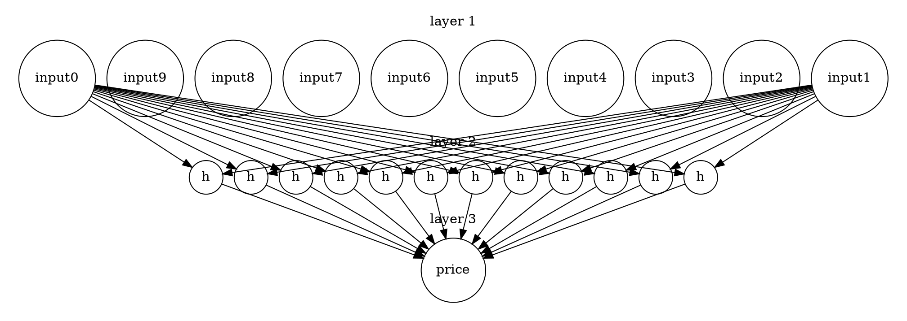
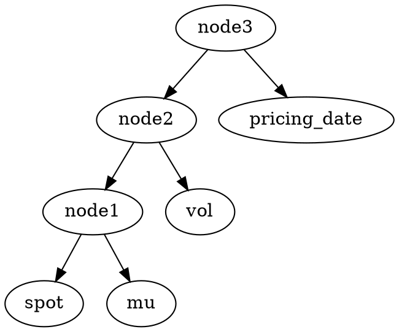
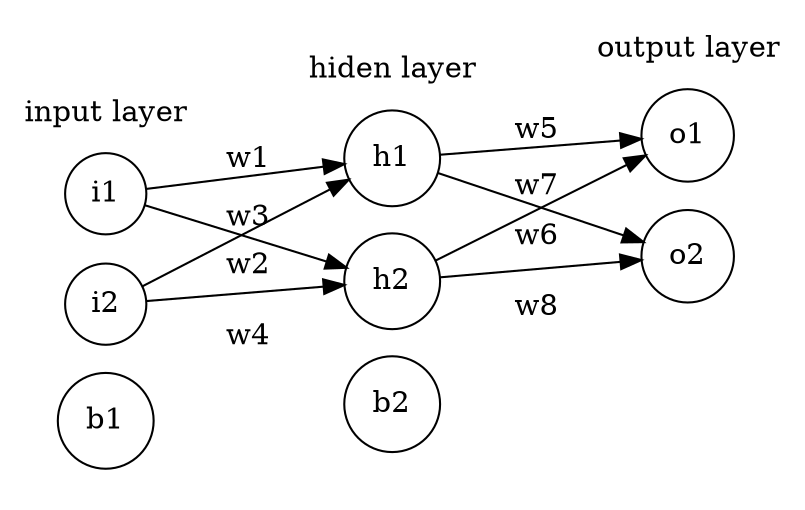

# 深度学习对结构化产品定价的尝试
>王鹏
>>2018年7-8月


这份tutorial分两个部分对结构化产品的定价展开探究，每个部分都是 ***先讨论蒙特卡洛模拟，再研究如何利用深度学习搭建合适的神经网络来逼近蒙特卡洛模拟的结果，具体的工作逻辑为：***
>对蒙特卡洛模拟部分：
模拟出多条标的物价格曲线 $\Rightarrow$ 判断在每条标的物价格曲线之下的敲出情况 $\Rightarrow$ 判断敲入情况 $\Rightarrow$ 依据收益计算规则得出合约价格

>对深度学习部分：
根据产品结构设计神经网络结构 $\Rightarrow$ 调用上述蒙特卡洛定价模块得到大量合约作为训练数据 $\Rightarrow$ 数据预处理 $\Rightarrow$ 训练&测试


***   

[TOC]           


## 1、初期尝试

### 1.1、雪球产品的结构图
|收益结构|雪球结构|
|-|-|
|期限|12个月|
|敲出观察频率|每月|
|敲入观察频率|每日|
|收益表现|任意一个观察日，挂钩标的收益水平 = 挂钩标的的收益水平 $\div$ 标的初期价格|
|敲出界限|100%|
|敲入界限|86%|
|敲出票息|14%（年化）|
|红利票息|14%（年化）|
|敲出事件|若在任意敲出观察日，挂钩标的当日收盘价格 $\div$ 期初价格 > 敲出界限|
|敲入事件|若在任意敲入观察日，挂钩标的当日收盘价格 $\div$ 期初价格 < 敲入界限|
|产品回报——敲出|产品提前终止及支付100%本金 + 敲出票息|
|产品回报——敲入且未敲出|$Min($期初价格 $\div$ 期末价格, 100%$)$|
|产品回报——即没敲入也没敲出|100%本金 + 红利票息|

### 1.2、信息提取
**根据上述产品信息，可从中提取出定价所需的可数字化的参数：**
- 产品合约期/duration：单位按月，整型；
- 敲出观察频率/knock_out_freq：单位按日，整型；
- 敲入观察频率/knock_in_freq：单位按日，整型；
- 敲出界限/knock_out_barrier：浮点型；
- 敲入界限/knock_in_barrier：浮点型；
- 敲出票息/knock_out_rate：浮点型；
- 红利票息/bonus：浮点型；
- 期望收益率/u：浮点型；
- 波动率/vol：浮点型；
- 标的物初期价格/spot：浮点型；

由以上产品参数，可得到代表一份产品的参数列表：

**key_list = [duration, knock_out_freq, knock_in_freq, knock_out_barrier, knock_in_barrier, knock_out_rate, bonus，u，vol, spot]**

注：
- 在 *初期尝试* 的过程中，上述的产品参数列表为定价部分的输入值，形式固定，参数相对位置不可更改；
- 如果需要产品参数中的某一个或某些以随机变量的形式生成，只需要将相应位置的参数设成 ***variant***， 后面的定价部分会自动处理；
- 当各个位置的变量被取成 ***variant*** 后，取值范围分别是：
  - duration: 12-24个月；
  - knock_out_freq: 1-252天，随机取整数；
  - knock_in_freq: 同上；
  - knock_out_barrier: 0.9-1.2，0，10；
  - knock_in_barrier: 0.7-0.9， 0，10；
  - knock_out_rate: 0-0.2;
  - bonus: 0-0.2;
  - u: 0-0.3;
  - vol: 0-0.3;
  - spot: 以100为基准，上下浮动5倍标准差；
#### 1.2.1、简单神经网络拓扑结构
显然，在确定了上述的抽象化产品输入结构后，神经网络的input layer维度就可以确定为10维。为了简化问题，这里只构建一个3层的简单网络结构，hiden layer维度为12，output layer维度为1，这样weight和bias矩阵的大小也都确定了。该网络的简单拓扑结构图如下：

### 1.3、雪球类产品定价模块构建
在确定上述输入变量形式后，我们可以构建以下的 ***SnowBall*** 类，其产品类参数初始化如下：
```
class SnowBall:

    duration = None
    knock_out_freq = None
    knock_in_freq = None
    knock_out_barrier = None
    knock_in_barrier = None
    knock_out_rate = None
    bonus = None
    spot = None
    std_spot = 100.
    argument = 100.
    u = None
    sigma = None
    curve_num = 50000
    r = 0.1
    bussiness_day = 252
    nature_day = 360
    bussiness_month = 21
    nature_month = 30
    month_num = 12
    stdi = np.float(np.sqrt(1./bussiness_day))
    aver = 0.
    tolerance = 0.001
```
神经网络类参数初始化如下：
```
session = None
   X_train_holder = None
   Y_train_holder = None
   Y_ = None
   cost = None
   optimizer = None
   w1 = None
   w2 = None
   b1 = None
   b2 = None
   ratio = 0.95

   learning_rate = 0.01
   input_num = 100
   input_dimension = 10
   output_dimension = 1
   hiden_layer_dimension = 12
   iteration = 3000
   accuracy = None
```
初始化函数：
```
def __init__(self, key_list):
    self.duration = key_list[0]
    self.knock_out_freq = key_list[1]
    self.knock_in_freq = key_list[2]
    self.knock_out_barrier = key_list[3]
    self.knock_in_barrier = key_list[4]
    self.knock_out_rate = key_list[5]
    self.bonus = key_list[6]
    self.u = key_list[7]
    self.sigma = key_list[8]
    self.spot = key_list[9]


    # build neural network
    self.create_network()

    # tensorflow
    self.session = tf.Session()
```
#### 1.3.1、蒙特卡洛部分
首先， 应根据产品合约参数生成标的物价格曲线。蒙特卡洛模拟的数学依据如下：
$$\begin{cases}
S_1 = S_0\times e^{vol\times W_t + (mu - \frac{vol^2}{2})\times \Delta t}\\
S_2 = S_1\times e^{vol\times W_t + (mu - \frac{vol^2}{2})\times \Delta t}\\
......\\
......\\
S_n = S_{n - 1}\times e^{vol\times W_t + (mu - \frac{vol^2}{2})\times \Delta t}\\
\end{cases}
$$
实现上述计算的代码如下，其中生成曲线所需的期望收益率、波动率以及曲线数目由使用者输入，$W_t$表示随机变量，会在这个过程中随机生成：
```
def underlying_curve(self, s0, t, curve_number, mu, vol):
    first = np.ones(curve_number)*s0
    length = np.int(t*self.bussiness_month)
    Wt = np.random.normal(self.aver, self.stdi, [curve_number, length-1])
    curve = s0*np.exp(vol*Wt+(mu-vol**2/2)/self.bussiness_day).cumprod(1)
    curve = np.c_[first, curve]
    return curve
```
在得到标的物价格曲线后，分别判断产品在续存期内是否有敲出和敲入事件发生：
```
def knock_out(self, upper_barrier, s0, frequency, underlying_curve, t):

    for i in range(np.int(self.bussiness_month * t / frequency)):

        index = int((i+1)*frequency)
        if underlying_curve[index-1]> s0*upper_barrier:
            return i+1
    return False

def knock_in(self, lower_barrier, s0, frequency, underlying_curve, t):

    for i in range(int(self.bussiness_month * t / frequency)):
        index = int((i+1)*frequency)
        if underlying_curve[index-1]< s0*lower_barrier:
            return True
    return False
```
随后，可以得到在现有的收益计算规则下，由一条标的物价格曲线得到的合约的价格：
```
def price_of_one_curve(self, one_product, one_curve):

    num = self.knock_out(one_product[3], self.std_spot, one_product[1], one_curve, one_product[0])
    if num:
        expire = num*self.nature_month/float(self.nature_day)
        discount_factor = np.exp(-self.r*expire)
        return self.argument * (1 + one_product[5] * expire)*discount_factor
    else:
        if self.knock_in(one_product[4], self.std_spot, one_product[2], one_curve, one_product[0]):
            receive = min(one_curve[-1] / self.std_spot, 1.)
            expire = one_product[0]/float(self.month_num)
            discount_factor = np.exp(-self.r*expire)
            return self.argument * receive * expire *discount_factor
        else:
            expire = one_product[0]/float(self.month_num)
            discount_factor = np.exp(-self.r*expire)
            return self.argument * (1 + one_product[6] * expire)*discount_factor
```
最后，通过多条蒙特卡洛模拟得到的价格曲线，取均值得到合约的期望价值：
```
def pricing(self, one_product):

    price = 0.
    curve = self.underlying_curve(one_product[-1], one_product[0], self.curve_num, one_product[7], one_product[8])
    for i in curve:

        price += self.price_of_one_curve(one_product, i)
    return price/self.curve_num
```    
#### 1.3.2、深度学习部分
在完成传统蒙特卡洛模拟定价部分之后，训练神经网络的记忆池就有了来源：基本思路是先生成多份合约参数不定的产品矩阵，矩阵的每一行代表一份不同的合约，然后利用上一部分的蒙特卡洛模拟来分别对产品矩阵的每一行进行定价，价格便代表label，是训练过程中要逼近的目标。换句话说，训练的目的并不是为了得到理论中合约的正确价格，而是逼近蒙特卡洛模拟得到的价格，这里默认蒙特卡洛模拟得到的价格是真实价值。产品矩阵的示意图如下：

$\begin{array}{c|llllllllll}
{index}&{duration}&{knock\ out \ freq}&{knock\ in\ freq}&{knock\ out\ barrier}&{knock\ in\ barrier}&{knock\ out\ rate}&{bonus}&{u}&{vol}&{spot}\\
{1}&{}&{}&{}&{}&{\cdots}\\
{2}&{}&{}&{}&{}&{\vdots}\\
{\vdots}&{}&{}&{}&{}&{\vdots}\\
\end{array}$


##### 1.3.2.1、记忆池生成
```
def book(self):

    '''
    产品续存期，取值范围12-24个月，随机取值取整数，可重复；
    :return:
    '''
    if self.duration is 'variant':
        c1 = np.random.random_integers(12,24,[self.input_num*1])
    else:
        c1 = np.ones((self.input_num,),dtype=np.int)*self.duration
    '''
    产品敲入和敲出观察频率，按天为单位，取值范围1-252天，随机取整数，可重复；
    '''
    if self.knock_out_freq is 'variant':
        c2 = np.random.random_integers(1,252,[self.input_num*1])
    else:
        c2 = np.ones((self.input_num,),dtype=np.int)*self.knock_out_freq

    if self.knock_in_freq is 'variant':
        c3 = np.random.random_integers(1,252,[self.input_num*1])
    else:
        c3 = np.ones((self.input_num,),dtype=np.int)*self.knock_in_freq

    '''
    两个barrier一上一下，upper barrier是0.9-1.2之间的float，随机取值；lower barrier是0.7-0.9之间的float，随机取值，并且上下界都
    可取到0和10，为了达到这种效果，利用了random函数的边缘特征，当随机变量取到区间左边界的时候，自动替换成0或10；
    '''
    if self.knock_out_barrier is 'variant':

        c4 = np.random.uniform(0.9, 1.2, [self.input_num*1])
        c4 = np.where(c4 == 0.9, np.random.choice([0., 10.]), c4)

    else:
        c4 = np.ones((self.input_num,))*self.knock_out_barrier

    if self.knock_in_barrier is 'variant':
        c5 = np.random.uniform(0.7, 0.9, [self.input_num*1])
        c5 = np.where(c5 == 0.7, np.random.choice([0., 10.]), c5)

    else:
        c5 = np.ones((self.input_num,))*self.knock_in_barrier

    '''
    敲出票息和红利都取到0-0.2；
    '''
    if self.knock_out_rate is 'variant':
        c6 = np.random.uniform(0,0.2,[self.input_num*1])
    else:
        c6 = np.ones((self.input_num,))*self.knock_out_rate

    if self.bonus is 'variant':
        c7 = np.random.uniform(0,0.2,[self.input_num*1])
    else:
        c7 = np.ones((self.input_num,))*self.bonus

    '''
    波动率和期望收益率都取到0-0.3；
    '''
    if self.u is 'variant':
        c8 = np.random.uniform(0., 0.3, [self.input_num*1])
    else:
        c8 = np.ones((self.input_num,))*self.u

    if self.sigma is 'variant':
        c9 = np.random.uniform(0., 0.3, [self.input_num*1])
    else:
        c9 = np.ones((self.input_num,))*self.sigma

    '''
    spot价格以100为基准，上下浮动5*std；

    '''
    if self.spot is 'variant':
        c10 = np.random.uniform(self.std_spot-5*self.stdi,self.std_spot+5*self.stdi,[self.input_num*1])
    else:
        c10 = np.ones((self.input_num,))*self.spot

    benchmark = np.c_[c1,c2,c3,c4,c5,c6,c7,c8,c9,c10]
    return  benchmark
```
根据 ***信息提取*** 部分的讨论，book函数通过处理输入参数，生成一个benchmark矩阵：该矩阵的size为m x n，其中n的值为10，即产品合约中参数的总个数，m为合约的总份数，可由我们自行确定。

当然，只有产品的benchmark还不够，我们还需要每份合约对应的价格，这时需要label函数：
```
def label(self, bench):

    holder = []
    clock = 1

    time_total = 0.

    for i in bench:
        start = ti.time()

        holder.append(self.pricing(i))

        end = ti.time()
        consum = end - start
        time_total += consum

        if clock%100 is 0:
            print time_total
        clock += 1
    print 'average time consumption: '+str(time_total/self.input_num)
    return np.array(holder)
```
在调用label函数时，我们将book函数得到的benchmark矩阵传入其中，得到相应的label矩阵并返回。

到这一步，记忆池就已生成，也就是我们本次要利用的训练集和测试集。

##### 1.3.2.2、神经网初始化

利用create_network函数初始化placeholder，weight和bias并结合计算关系得到cost和optimizer。
```
def create_network(self):
    self.X_train_holder = tf.placeholder(shape=[int(self.input_num*self.ratio), self.input_dimension], dtype= tf.float32)
    self.Y_train_holder = tf.placeholder(shape=[int(self.input_num*self.ratio), self.output_dimension], dtype= tf.float32)

    self.w1 = tf.random_uniform(shape=[self.input_dimension, self.hiden_layer_dimension], minval=-0.05
    ,maxval=0.05, dtype=tf.float32, name='weight1')
    self.b1 = tf.Variable(tf.zeros([1, self.hiden_layer_dimension]), dtype= tf.float32)
    l1 = tf.nn.relu(tf.matmul(self.X_train_holder, self.w1) + self.b1)

    self.w2 = tf.random_uniform(shape=[self.hiden_layer_dimension, self.output_dimension], minval=-0.05
    ,maxval=0.05, dtype=tf.float32, name='weight2')
    self.b2 = tf.Variable(tf.zeros([1, self.output_dimension])+ 0.1, dtype= tf.float32)
    self.Y_ = tf.nn.relu(tf.matmul(l1, self.w2) + self.b2)

    self.cost = tf.reduce_mean(tf.square(self.Y_train_holder - self.Y_)) / 2.
    self.optimizer = tf.train.GradientDescentOptimizer(self.learning_rate).minimize(self.cost)
```
开始训练进程：
```
@property
    def train_test(self):

        benchmarks = self.book()

        labels = self.label(benchmarks)

        train_set = benchmarks[0:int(self.input_num*self.ratio)]
        test_set = benchmarks[int(self.input_num*self.ratio):self.input_num]

        y_train = labels[0:int(self.input_num*self.ratio)].reshape([int(self.input_num*self.ratio),1])
        y_test = labels[int(self.input_num*self.ratio):self.input_num].reshape(int(self.input_num-int(self.input_num*self.ratio)),1)

        self.session.run(tf.global_variables_initializer())


        for rand in range(self.iteration):

            self.session.run(self.optimizer,feed_dict={self.X_train_holder: train_set, self.Y_train_holder: y_train})

        weight1, weight2, bias1, bias2 = self.session.run([self.w1, self.w2, self.b1, self.b2])

        hiden_layer = tf.nn.relu(tf.matmul(tf.cast(test_set, tf.float32), self.w1)+ self.b1)

        y_predict = tf.nn.relu(tf.matmul(hiden_layer, self.w2)+ self.b2)

        count = tf.divide(np.abs(y_predict-y_test),y_test)

        mat = count - self.tolerance
        result = self.session.run(mat)

        return weight1, weight2, bias1, bias2, result
```
利用梯度下降算法最小化cost，将得到的参数矩阵返回。

需要留意的是，该train_test函数内部已经包含了测试模块儿，即从生成的记忆池中整体取出**百分之五**的合约，来验证预测价格和真实label之间的差距，返回到result矩阵，该矩阵代表误差率，其中每个元素的定义为：

$item := \frac{\vert price_{prediction} - price_{monto} \vert}{price} - tolerance$

由此可见， item的值越小越好。
##### 1.3.2.3、调用方法和测试结果

调用训练和测试模块的方法很简单，只要进入snowball的main函数部分即可：
```
if  __name__ == "__main__":

    print 'snowball.py is being called directly'

    factor_list = ['variant', 21, 1, 1., 0.86, 0.14, 0.14, 'variant', 'variant', 'variant']

    sample = SnowBall(factor_list)

    sample.create_network()

    a, b, c, d, accuracy = sample.train_test

    np.savetxt('/Users/wangpeng/tutu/htsc/product/snow/factor/weight1.txt', a)
    np.savetxt('/Users/wangpeng/tutu/htsc/product/snow/factor/weight2.txt', b)
    np.savetxt('/Users/wangpeng/tutu/htsc/product/snow/factor/bias1.txt', c)
    np.savetxt('/Users/wangpeng/tutu/htsc/product/snow/factor/bias2.txt', d)


    print 'weight1:', a
    print 'weihtt2:', b
    print 'bias1:', c
    print 'bias2:', d
    print 'accuracy matrix:', accuracy
```
主程序会自主按照设定生成记忆池，分配相应的训练集和测试集比例，并将训练的到的参数矩阵写入到本地目录。本次试验，我暂且让spot、duration、mu和vol四个参数随机变化，随机生成1000份合约，用其中的950份进行训练，50份进行测试，得到如下图所示的部分训练结果：
```
accuracy matrix:
[[ 1.39611885e-02  2.53940877e-02 -6.54562726e-04  5.58352843e-03 1.61072053e-02]
 [ 3.36400513e-03  2.10642200e-02  1.55529706e-05  3.09295068e-03 2.85344515e-02]
 [ 2.76234793e-03  1.38636178e-03  3.70733556e-04  2.64892215e-03 4.59089549e-03]
 [ 2.96867592e-03  3.01058404e-03  1.24079932e-03  1.54732552e-03 4.05404600e-04]
 [ 1.90638043e-02  2.19798042e-03  1.71748102e-02  7.10202660e-03 6.70673326e-05]
 [ 3.33881890e-03  2.29271455e-03  6.00165594e-03  2.77787121e-03 3.84398270e-03]
 [-1.33162423e-04  2.95189675e-04  5.67997480e-03  4.63447906e-03 -5.70521690e-04]
 [ 8.43761954e-03  9.92057845e-03  4.46938351e-03  3.52517664e-02 2.43062386e-03]
 [-1.92565261e-04  1.90769788e-05  1.26360834e-03  1.85952091e-03 3.15820193e-03]
 [ 2.57578958e-03  2.38044839e-03  1.36827666e-03  1.52437501e-02 -5.09975129e-04]]
```

依据图中结果，我们可以认为，在本次试验的设定之下，误差收敛的很好。

为了方便对某一份产品进行单独的定价，这里单独提供了一份定价的文件: pricing
```
input_list = [12, 21, 1, 1., 0.86, 0.14, 0.14, 0.1, 0.2, 100.]

W1 = np.loadtxt('/Users/wangpeng/tutu/htsc/product/snow/factor/weight1.txt')
W2 = np.loadtxt('/Users/wangpeng/tutu/htsc/product/snow/factor/weight2.txt')
b1 = np.loadtxt('/Users/wangpeng/tutu/htsc/product/snow/factor/bias1.txt')
b2 = np.loadtxt('/Users/wangpeng/tutu/htsc/product/snow/factor/bias2.txt')

'''
传统蒙特卡洛定价
'''
def monto(list):
    product = nt.SnowBall(list)
    price1 = product.pricing(list)
    return price1
price1 = monto(input_list)
'''
神经网络定价
'''
def nn(list):
    input_array = np.array(list).reshape(1,10)
    net1 = np.dot(input_array, W1)+b1
    out1 = np.where(net1<0, 0., net1)

    net2 = np.dot(out1, W2)+b2
    out2 = np.where(net2<0, 0., net2)
    price2 = out2[0]
    return price2
price2 = nn(input_list)

print '蒙特卡洛：'+ str(price1)
print '神经网：'+ str(price2)
```
使用者可以通过更改input_list中相应位置的参数值，来对不同的产品进行定价，即可以调用蒙特卡洛模拟法，也可以调用训练好的神经网。

## 2、真实化产品合约定价
虽然第一部分中的训练在相应的条件下得到了很好的结果，但却存在一个极其关键的问题，***产品合约不真实***：

>现实中进行交易的产品合约，诸如鑫益系列，其合约参数中与时间相关的变量严格遵循真实日历，即存在合约起始日、合约到期日、定价日的概念。同时，产品的敲出和敲入观察日也都取自真实日历中的交易日。

回顾在第一部分中被我们定义的产品结构，显然存在以下问题：
- 用产品续存期的概念代替了合约起始日、合约到期日和定价日。这样的做不不止不灵活，更关键的是在这样的设定后，我们只能得到合约起始日产品的价格，一旦我们想得到合约期内某一交易日产品的价值，或进行Theta的计算，这种做法就立即失效;
- 另外，以固定的频率，如每日或每月来表示敲入和敲出观察日的做法有悖于实际。真实日历之下的敲出和敲出观察日很可能为时间间隔不固定的时间序列；
- 对于敲出和敲入之后利率的表征，第一部分中的做法也不严谨。产品在不同的日期敲出或者敲出，很可能产生不同的收益率。换句话说，敲出和敲入收益率不应该简单的设定成一个数值，而应该可以被设定成一个和敲出或敲入观察日序列等长的利率序列。

对结构化产品进行定价，优秀的价格生成器应满足灵活、真实和高效的特征。以autocall类产品为例，在不考虑最后收益计算部分的规则的情况下，对使用者而言，定价所需产品输入参数和可输入形式应如下表：

|输入项目|可输入形式|
|-|-|
|合约起始日|’2017/11/9’|
|合约到期日|‘2018/11/15’|
|定价日|’2017/11/19‘|
|标的物价格|100.|
|敲出观察日|['2017/12/14'],['2018/1/11'],['2018/2/8'],['2018/3/8'],['2018/4/12'],['2018/5/10'],['2018/6/14'],['2018/7/12'],['2018/8/9'],['2018/9/13'],['2018/10/11']|
|敲入观察日|‘all’（注：也可以同敲出观察日一样，输入一串时间）|                             
|敲出障碍|1.（注：敲出障碍可以按敲出观察日取不同值，可以输入序列）|
|敲入障碍|0.86（同上）|
|敲出收益率|0.14（注：不同的敲出观察日之下可以有不同的敲出收益，也可以输入序列）|
|票面利率|0.14|
|期望收益率|-0.12|
|波动率|0.15|
|无风险利率|0.（注：无风险利率本不该是0，这里做了简单的处理，通过调整期望收益率，以使得在定价时，无风险利率保持为0）|

事实上，上表所呈现的正式一个web定价平台的用户端界面，用户通过在相应位置输入自定义的变量，对相应的产品进行定价。为了保证使用者能对autocall这类结构繁多产品进行定价，输入参数形式的设定必须足够灵活。显然，第一部分的做法不能满足这样的要求。

### 2.1、标准化真实合约——真实日历
为了实现上表所示的标准化真实合约，我们有必要自定义一个单独的日历模块。日历作为一个地区交易时间参照，有强烈的地域性特征。具体而言，该模块应满足以下要求：
- 能将输入的字符串格式的日期转化成datetime格式；
- 能对时间序列进行切割；
- 能够上传并读取一份holiday file；
- 能取出某一日期之后的下一个交易日，能判读某一日期是否为工作日；
- 能根据两个时间点生成一段时间序列。

上述模块参考了quantlib和excel对日期的处理方式，返回值都为datetime格式，方便处理，具体代码可以查看[BussinessCalender](https://github.com/qiyexue777/pricing_structured_product/tree/master/Bussiness_Calender)。
在实际使用过程中，该模块能满足绝大多数处理日期的需求，但这一次没有加入按固定漂移频率生成日期序列的功能，这以功能在自动生成敲出观察日序列的过程中很实用。然而，这一功能的实现依赖于实际交易规则，所以这次就暂且不考虑。

这里还提供了一个日历模块的简单测试，代码如下：
```
from Bussiness_Calender import Bcalender
import numpy as np
test = Bcalender.BussinessCalender()
rec = test.loadfile()
print np.array(test.timeseries(rec[0],rec[1])).reshape(6,4)
```

通过loadfile函数，我们将holiday_test.csv中的两个日期'2018/1/1'和'2018/2/1'导入，并以这两个日期为起点和终点，生成一串只含有工作日的时间序列：

```
[[datetime.date(2018, 1, 1) datetime.date(2018, 1, 2)
  datetime.date(2018, 1, 3) datetime.date(2018, 1, 4)]
 [datetime.date(2018, 1, 5) datetime.date(2018, 1, 8)
  datetime.date(2018, 1, 9) datetime.date(2018, 1, 10)]
 [datetime.date(2018, 1, 11) datetime.date(2018, 1, 12)
  datetime.date(2018, 1, 15) datetime.date(2018, 1, 16)]
 [datetime.date(2018, 1, 17) datetime.date(2018, 1, 18)
  datetime.date(2018, 1, 19) datetime.date(2018, 1, 22)]
 [datetime.date(2018, 1, 23) datetime.date(2018, 1, 24)
  datetime.date(2018, 1, 25) datetime.date(2018, 1, 26)]
 [datetime.date(2018, 1, 29) datetime.date(2018, 1, 30)
  datetime.date(2018, 1, 31) datetime.date(2018, 2, 1)]]
```  

综上，在考虑了真实日历之后，我们可以将一份autocall合约抽象化，取出合约中关键的定价参数，组成参数dictionary如下：
```
{
    'start': '2017/11/9',
    'end': '2018/11/15',
    'pricing_date': '2017/11/9',
    'spot': 100.,
    'knockoutdays': [['2017/12/14'],['2018/1/11'],['2018/2/8'],['2018/3/8'],['2018/4/12'],['2018/5/10'],['2018/6/14'],
                     ['2018/7/12'],['2018/8/9'],['2018/9/13'],['2018/10/11']],
    'knockindays': 'all',
    'upper_barrier': 1.,
    'lower_barrier': 0.86,
    'interest_rate': 0.14,
    'knockoutrate': 0.14,
    'mu': 0.1,
    'vol': 0.2,
    'r': 0.1
}
```

以这种形式来抽象化产品的好处有很多，除了清晰明了之外，这样的结构尤其适合搭建产品数据库。

### 2.2、蒙特卡洛模拟定价
新建一个class autocall，并将参数初始化如下，其中13个定价所需关键参数由使用者确定，5个默认参数提供如下所示的参考标准输入值，使用者也可以自行更改。
```
class autocall:

    '''
    合约类参数，由于此次强调实用性和专业性，所以，即便对计算无实际意义的合约参数和类属性，保留属性，并且在生成之后的产品对象时，参数以dictionary的格式传入
    '''

    start = None  # 起始日--------------------✔️
    end = None  # 到期日----------------------✔️
    pricing_date = None #定价日---------------✔️-theta, 定价日的概念极其重要，具体而言，定价日分三类：1. 定价日处于合约期之前，这种情况下，
    # 我们要知道该日的标的物收盘价，并以其为spot蒙特卡洛到期初观察日的价格，生成合约期的标的物价格曲线，然后进行定价；2. 定价日处于合约期中（包括
    # 左右边界），这时候我们要知道定价日的spot并靠它生成之后的价格曲线；3. 定价日在合约期之后，这种情况考虑意义不大，因为历史价格都已确定，没有定价
    #的必要了
    spot = None  # 标的物初期价格--------------✔️-delta, gamma
    knockoutdays = None #敲出观察日------------×
    knockindays = None #敲入观察日-------------×
    upper_barrier = None #敲出障碍-------------×️
    lower_barrier = None #敲入障碍-------------×️
    interest_rate = None #票面利率，年化--------✔️
    knockoutrate = None #敲出收益率，年化--------×️
    mu = None #期望收益率，年化，r+repo+div------✔️-rho
    vol = None #波动率-------------------------✔️-vega
    r = None #无风险收益率，年化-----------------✔️-rho
    calender = None
    '''
    做标记的参数都是合约最关键的数值参数，是进行后续计算必不可少的参量；✔表示该参数为数值，类型与意义相符；×表示该数据可能为list结构也可能为数值，
    需要在使用前进行判断，切记。
    '''
    year_count = None  # 年度计息天数----------
    argument = None #本金---------------------
    std_spot = None #标的物价格变化基准---------
    curve_num = None #模特卡洛曲线数量----------
    delta_t = 1./252
    stdi = (delta_t)**0.5 #蒙特卡洛随机数标准差，由于标的物价格曲线逐日生成，所以delta t应为年化后的时间间隔，全年交易日按252计算------------
    aver = 0. #蒙特卡洛随机数均值--------------
    tolerance = 0.001 #准许误差-----------------
    '''
    以上这部分参数相对固定，与产品的变化相关性不太大，所以可以在初始化对象的时候赋默认的参数，这样也留下了自定义修改的可能；
    '''


    def __init__(self, calender, inputdict, year= 365, argument= 100, std_spot= 100., curve_num= 50000, bookdict= bookdictionary):
      self.year_count = year
      self.argument = argument
      self.std_spot = std_spot
      self.curve_num = curve_num

      self.calender = calender

      '''
      这里应该把bookdict中的键值取出来并赋给上面的所有非计算属性，暂且空出来，不影响开发过程
      '''
      self.start = inputdict['start']
      self.end = inputdict['end']
      self.pricing_date = inputdict['pricing_date']
      self.spot = inputdict['spot']
      self.knockoutdays = inputdict['knockoutdays']
      self.knockindays = inputdict['knockindays']
      self.upper_barrier = inputdict['upper_barrier']
      self.lower_barrier = inputdict['lower_barrier']
      self.interest_rate = inputdict['interest_rate']
      self.knockoutrate = inputdict['knockoutrate']
      self.mu = inputdict['mu']
      self.vol = ['vol']
      self.r = ['r']

```
#### 2.2.1、模拟生成相应标的物价格曲线
此次模拟出的价格曲线不在只包含单一的标的物收盘价，而是按时间向前的时间序列：
|日期|day1|day2|day3|...|
|-|-|-|-|-|
|收盘价|p1|p2|p3|...|

代码如下：
```
def underlying_curve(self, s0, start, end, curve_num, mu, vol):
    dateseries = self.calender.timeseries(start, end)
    t = len(dateseries)
    first = np.ones(curve_num)*s0
    np.random.seed(0)
    Wt = np.random.normal(self.aver, self.stdi, [curve_num, t-1])
    curve = s0*np.exp(vol*Wt + (mu - vol**2/2)*self.delta_t).cumprod(1)
    curve = np.c_[first, curve]
    curve = pd.DataFrame(curve, columns=dateseries)
    return curve
```
该曲线严格依照产品实际的续存期生成，start和end分别代表合约剩余期限的起点和终点。
#### 2.2.2、敲出和敲入判断
同样的与之前的做法不同，这里对敲入和敲出的判断要考虑非常多的因素：首先是定价日是否在合约期之内，其次当定价日在合约期内，还应该考虑是否还有剩余的敲入和敲出观察日等等。代码如下：
```
def knock_out(self, outdate, upper_barriers, std_price, underlying_curve):
    if outdate == []:
        return False
    else:
        if type(upper_barriers) is list:
            lg = len(outdate)
            for i in range(lg):
                index = outdate[i]
                if underlying_curve[index] > std_price*upper_barriers[i]:
                    return index
            return False
        else:
            for i in outdate:
                if underlying_curve[i] > std_price*upper_barriers:
                    return i
            return False

def knock_in(self, indate, lower_barriers, std_price, underlying_curve):
    if indate == []:
        return False
    else:
        if indate is 'all':
            for i in underlying_curve.index:
                if underlying_curve[i] < std_price*lower_barriers:
                    return True
            return False
        else:
            if type(lower_barriers) is list:
                lg = len(indate)
                for i in range(lg):
                    index = indate[i]
                    if underlying_curve[index] < std_price*lower_barriers[i]:
                        return True
                return False
            else:
                for i in indate:
                    if underlying_curve[i] < std_price*lower_barriers:
                        return True
                return False
```
#### 2.2.3、输入参数预处理
不要忘了，用户在定价时按照我们设定好的dictionary结构输入的参数大多为字符串类型，而我们定价过程中要利用的显然不能是字符串，尤其是日期数据。所以，在真正的进入定价过程之前，我们必须做数据的预处理，将字符串类型的日期转化成datetime格式。
另一点需要在数据预处理过程中完成的是输入数据的切割：一旦定价日在合约期内，那么合约起始日到定价日之间的信息都为历史数据，不需要考虑，需要剔除。
以上两部分工作的完成都要用到之前日历模块的一些功能，数据处理的代码如下：
```
# string to datetime
def inputtrans(self, one_product):
    one_product['start'] = self.calender.stringtodate(one_product['start'])
    one_product['end'] = self.calender.stringtodate(one_product['end'])
    one_product['pricing_date'] = self.calender.stringtodate(one_product['pricing_date'])
    one_product['knockoutdays'] = Bcalender.element_wise_op(one_product['knockoutdays'], self.calender.stringtodate)
    if type(one_product['knockindays']) is list:
        one_product['knockindays'] = Bcalender.element_wise_op(one_product['knockindays'], self.calender.stringtodate)
    return one_product

# 数据切割
def prepareforinput(self, label, one_product):
    one = self.inputtrans(one_product)
    if label is 'in':
        # out部分
        # 1. outlist空了
        firstout = self.calender.cut(one['knockoutdays'], one['pricing_date'])
        if firstout is 'empty':
            one['knockoutdays'] = []
        # 2. outlist非空
        else:
            one['knockoutdays'] = one['knockoutdays'][firstout:]
            if type(one['upper_barrier']) is list:
                one['upper_barrier'] = one['upper_barrier'][firstout:]
            if type(one['knockoutrate']) is list:
                one['knockoutrate'] = one['knockoutrate'][firstout:]
        # in部分
        # 1. indays是list
        if type(one['knockindays']) is list:
            firstin = self.calender.cut(one['knockindays'], one['pricing_date'])
            if firstin is 'empty':
                one['knockindays'] = []
            else:
                one['knockindays'] = one['knockindays'][firstin:]
                if type(one['lower_barrier']) is list:
                    one['lower_barrier'] = one['lower_barrier'][firstin:]
        # 2. indays是all，不需要切割
    else:
        return one
    return one
```    
经过上面两个步骤处理之后的input才是定价过程中真正要利用和处理的输入。

#### 2.2.4、定价
这一块儿的逻辑和第一部分中蒙特卡洛模拟类似，也是先得到任意一条曲线的产品价格，然后在把做法拓展到所有的曲线，最后取均值。在初始化部分，我们默认单一产品模拟曲线条数为50000，产品合约本金为100.，一年的自然日天数为365，交易日天数为252，代码如下：        
```
def price_one_curve(self, label, one_curve, start, end, pricing_date, outdate, indate, upper, lower,
                    outrate, divident, r):
    outday = self.knock_out(outdate, upper, self.std_spot, one_curve)
    if label is 'in':
        if outday:
            if type(outrate) is list:
                receive = outrate[outdate.index(outday)]
                expire = (outday - pricing_date).days/float(self.year_count)
                discount_factor = np.exp(-r*expire)
                return self.argument*(1 + receive*expire)*discount_factor
            else:
                receive = outrate
                expire = (outday - pricing_date).days/float(self.year_count)
                discount_factor = np.exp(-r * expire)
                return self.argument * (1 + receive * expire) * discount_factor
        else:
            if self.knock_in(indate, lower, self.std_spot, one_curve):
                receive = min(one_curve[end]/self.std_spot, 1.)
                expire = (end - pricing_date).days/float(self.year_count)
                discount_factor = np.exp(-r*expire)
                return self.argument*receive*expire*discount_factor
            else:
                receive = divident
                expire = (end - pricing_date).days/float(self.year_count)
                discount_factor = np.exp(-r*expire)
                return self.argument*(1 + receive*expire)*discount_factor
    else:
        if outday:
            if type(outrate) is list:
                receive = outrate[outdate.index(outday)]
                interest_countdays = (outday - start).days/float(self.year_count)
                expire = (outday - pricing_date).days/float(self.year_count)
                discount_factor = np.exp(-r*expire)
                return self.argument*(1 + receive*interest_countdays)*discount_factor
            else:
                receive = outrate
                interest_countdays = (outday - start).days / float(self.year_count)
                expire = (outday - pricing_date).days/float(self.year_count)
                discount_factor = np.exp(-r * expire)
                return self.argument * (1 + receive * interest_countdays) * discount_factor
        else:
            if self.knock_in(indate, lower, self.std_spot, one_curve):
                receive = min(one_curve[end]/self.std_spot, 1.)
                interest_countdays = (end - start).days/float(self.year_count)
                expire = (end - pricing_date).days/float(self.year_count)
                discount_factor = np.exp(-r*expire)
                return self.argument*receive*interest_countdays*discount_factor
            else:
                receive = divident
                interest_countdays = (end - start).days / float(self.year_count)
                expire = (end - pricing_date).days/float(self.year_count)
                discount_factor = np.exp(-r*expire)
                return self.argument*(1 + receive*interest_countdays)*discount_factor

def pricing(self, one_product):
    price = 0.
    label = self.dtype(one_product['pricing_date'], one_product['start'], one_product['end'])
    if label is 'in':
    # 开始处理输入信息，包括日期格式的转化和有效时间程度的切割，使得数据可以使用.
        after = self.prepareforinput(label, one_product)
        curve = self.underlying_curve(after['spot'], after['pricing_date'], after['end'], self.curve_num, after['mu'], after['vol'])
        for i in range(self.curve_num):
            one_curve = curve.loc[i]
            price += self.price_one_curve(label, one_curve, after['start'], after['end'], after['pricing_date'], after['knockoutdays'],
                                          after['knockindays'], after['upper_barrier'], after['lower_barrier'], after['knockoutrate'],
                                          after['interest_rate'], after['r'])
        return price/self.curve_num
    else:
        after = self.prepareforinput(label, one_product)
        # 注：此处传入underlying_curve中的spot为用户输入的产品参数，也就是start当日的标的物收盘价，这个价格在当下的定价日是不存在的，也即是需要预测的
        #未来价格，但方便起见这里写成了用户输入。
        curve = self.underlying_curve(after['spot'], after['start'], after['end'], self.curve_num, after['mu'], after['vol'])
        for i in range(self.curve_num):
            one_curve = curve.loc[i]
            price += self.price_one_curve(label, one_curve, after['start'], after['end'], after['pricing_date'],
                                          after['knockoutdays'],
                                          after['knockindays'], after['upper_barrier'], after['lower_barrier'],
                                          after['knockoutrate'],
                                          after['interest_rate'], after['r'])
        return price/self.curve_num
```
需要说明的是，当产品合约用这样真实的方式来抽象时，其定价的复杂度和时间消耗与第一部分大大不同：这里为一份合约定价大概耗时10-14s，而第一部分为一份产品定价平均耗时仅1.8s左右。***带有价格的不同合约是之后训练各种神经网络必要的输入，当蒙特卡洛模拟对单份合约定价的耗时过久的时候，我们就很难得到足够大的样本空间，神经网络得到的训练集也很受限制，这是目前的一个技术难点之一，后面也会继续提到。***

### 2.3、搭建MongoDB产品数据库
MongoDB是现在非常受欢迎的非关系型数据库，很适合存储产品合约类的数据，轻量且响应迅速，方便小规模开发使用，想阅读该数据库的官方文档可以转到[MongoDB](https://docs.mongodb.com)。

带有价格的产品合约是需要反复利用的参量，结合上面提到的时间消耗问题，如果我们每需要一份不同的合约，就去运行一个蒙特卡洛模拟来得到合约价，那整体的时间消耗将十分巨大。为了方便重复利用，特在此搭建MongoDB数据库，将需要的训练数据一次性存储，之后的调用就十分便利了。搭建好的数据库地址和collection名称如下：
```
# 数据库设置
myclient = pymongo.MongoClient('mongodb://localhost:27017/')
mydb = myclient['pricing']
mycol = mydb['new_record']
```
理想的状态下，我们希望之后神经网络得到的训练集的样本空间足够离散且足够大，然而这一条件在我们之前的工作前提下很难被满足。回顾我们标准化的产品结构，产品dictionary中含有13个可变输入值，为了保证样本空间的充足和多样，我们假设每个参数有100中变化可能，那么，总的样本空间大小为：$100\times100.....\times100 = {10}^{26}$。即便每个参数只有10种变化可能，那样本空间也达到$10\times10.....\times10 = {10}^{13}$ 的级别。这样的数据量再结合之前提到的每次蒙特卡洛定价十几秒左右的时间损耗，我们几乎不可能在现有条件下兼顾上述所有的要求，控制可变数据的个数是十分必要的，具体的做法为：

1. 以如下这一份产品为基准合约：
```
std_info= {
    'start': '2017/11/9',
    'end': '2018/11/15',
    'pricing_date': '2017/11/9', # 可变
    'spot': 100.,  # 可变
    'knockoutdays': [['2017/12/14'],['2018/1/11'],['2018/2/8'],['2018/3/8'],['2018/4/12'],['2018/5/10'],['2018/6/14'],
                     ['2018/7/12'],['2018/8/9'],['2018/9/13'],['2018/10/11']],
    'knockindays': 'all',
    'upper_barrier': 1.,
    'lower_barrier': 0.86,
    'interest_rate': 0.14,
    'knockoutrate': 0.14,
    'mu': -0.12, # 可变
    'vol': 0.15, # 可变
    'r': 0.
}
```

2. >只关注计算greeks过程中需要变化的输入变量，即spot、pricing_date，mu和vol。剩余的9个参数设定为固定的合约参数。具体取值方法为：
    >>- spot：基准值100，上下浮动百分之五，以0.1%为步长，取100个点
    >>- pricing_date：在续存期内，取四个点：['2017/11/9', '2018/2/19', '2018/5/21', '2018/8/20']，基准值为'2017/11/9'
    >>- mu：取两个点，-0.12，-0.4，基准值为-0.12
    >>- vol：取两个点，0.15，0.25，基准值为0.15

因此，总样本空间大小为：$100\times4\times4\times4 = 1600$

生成这1600+份合约和上传数据库的过程此处略过，具体可以查看代码[upload data](https://github.com/qiyexue777/pricing_structured_product/blob/master/Auto_Call/dl_autocall/pricing/new_data_to_db.py)。上传完成后，单一合约在数据库中的表示为：
```
{
	"_id" : 1,
	"end" : "2018/11/15",
	"knockoutdays" : [
		[
			"2017/12/14"
		],
		[
			"2018/1/11"
		],
		[
			"2018/2/8"
		],
		[
			"2018/3/8"
		],
		[
			"2018/4/12"
		],
		[
			"2018/5/10"
		],
		[
			"2018/6/14"
		],
		[
			"2018/7/12"
		],
		[
			"2018/8/9"
		],
		[
			"2018/9/13"
		],
		[
			"2018/10/11"
		]
	],
	"upper_barrier" : 1,
	"vol" : 0.15,
	"pricing_date" : "2018/2/19",
	"lower_barrier" : 0.86,
	"spot" : 95.6,
	"mu" : -0.04,
	"start" : "2017/11/9",
	"r" : 0,
	"knockindays" : "all",
	"knockoutrate" : 0.14,
	"price" : 0.8680125359665264,
	"interest_rate" : 0.14
}
```
除了原有的dictionary内部元素之外，上传到数据库之后的每份合约都多了一个 ***_id*** 属性，这是其在数据库中的唯一代号，方便调用；另外，还可以发现， ***price*** 属性已经存于其中。
### 2.4、利用递归神经网络定价
当合约的结构被抽象成上面的形式时，之前用来定价的网络结构变得不再可取，具体原因包括：
- 之前的神经网络没有时间的概念，无法满足真实日历下定价的要求；
- autocall这类结构化产品的定价本质上存在很明显的结构化特征，尤其是在利用蒙特卡洛模拟为其定价的过程中，我们要严格遵循序言中提到的逻辑顺序，每部分使用到的定价参数也都不同，即不同参数的实际意义和在网络中的角色不应该是简单的堆叠关系。

为了解决上述的两个问题，我们要对产品的输入参数进行分类和处理，使它们明显的体现出区别；另外，我们还需要重新设计神经网络的结构，使其能反映出产品在定价过程中的真实逻辑。

#### 2.4.1、产品合约参数的向量化
autocall真实合约除去calendar和一些固定的合约参数之外，共含有13个数值变量，这些变量按类型可分为：
- value类：spot，upper barrier， lower barrier；
- time类：start date，end date，pricing date，knockout days，knockin days；
- rate类：interest rate，knockout rate，mu，vol，r；

所以，可以根据这三个维度，建立一个三维产品空间 $P(v-t-r)$，这里用一份非真实合约向量化后的事例来说明具体的做法：
```
{
            'start': '2017/11/9',
            'end': '2018/11/15',
            'pricing_date': '2017/11/9', # 可变
            'spot': 100.,  # 可变
            'knockoutdays': [['2017/12/14'],['2018/1/11']],
            'knockindays': [['2018/9/13'],['2018/10/11']],
            'upper_barrier': 1.,
            'lower_barrier': 0.86,
            'interest_rate': 0.14,
            'knockoutrate': 0.14,
            'mu': -0.12, # 可变
            'vol': 0.15, # 可变
            'r': 0.
    }
```
这种形式的合约我们已经不陌生，在经过向量化处理后，该合约变成：
```
{
            'end': array([[1., 0., 0.]]),
            'knockoutdays': array([[[0.        , 0.09677419, 0.        ],[0.        , 0.17204301, 0.        ]]]),
            'upper_barrier': array([[[1., 0., 0.],[1., 0., 0.]]]),
            'vol': array([[0., 0., 0.15]]),
            'pricing_date': array([[0., 0., 0.]]), 'lower_barrier': array([[[0.86, 0.  , 0.  ],[0.86, 0.  , 0.  ]]]),
            'spot': array([[100., 0., 0.]]),
            'mu': array([[0., 0., -0.12]]),
            'start': array([[0., 0., 0.]]),
            'r': array([[0., 0., 0.]]),
            'knockindays': array([[[0.        , 0.83064516, 0.        ],[0.        , 0.90591398, 0.        ]]]),
            'knockoutrate': array([[[0.  , 0.  , 0.14],[0.  , 0.  , 0.14]]]),
            'interest_rate': array([[0.  , 0.  , 0.14]])
    }
```
这里需要做几点说明：
- 如图所示，各个参数在向量化处理之后，只在自己所在的维度拥有非零的数值，其他维度都被归一化为0；
- value类和rate类的参数基本保留了自己原有的数值，但这里对time类的参数做了一定程度的处理，取合约起始日为时间零点，初始化为[0, 0, 0]，取合约到期日为终点，初始化为[0, 1, 0]，剩余的日期类数值一律按照时间间隔归一化到区间[0, 1]之间。如这里的pricing date，由于定价日和合约起始日重合，所以向量化之后的结果为[0, 0, 0]。这样将日期归一化的做法是十分必要的，因为在三个不同维度中，日期变量在数值上的离散度非常大，如果不加以控制，会使得其他两个维度的存在失去意义。

同之前的日历模块一样，这里也存在一个单独的 ***data_vector*** 模块来负责合约的向量化。除此之外，这个模块还负责数据调用的功能，因为在之前的搭建数据库部分，我们曾取合约中的4个参数为随机变量，模拟生成了1600份左右的合约并上传到了本地数据库中，这些合约是我们之后训练必备的样本，而这个模块就承担了极其重要的数据预处理的角色，详情参见[data vector](https://github.com/qiyexue777/pricing_structured_product/blob/master/Auto_Call/dl_autocall/pricing/data_vector.py)。
####2.4.2、递归神经网的拓扑结构
在当下众多应用广泛的神经网络结构中，递归神经网络是相对更加适合处理结构化数据的一种网络，常被用于分析树结构或图结构的文本性输入，进行语义分析。而我们此次为结构化产品定价的思路恰好也能够被理解成是按照一定的树结构层层递进，最终得到一个所谓的产品向量。有了这样的理论基础，我们就可以开始按照蒙特卡洛模拟的定价逻辑来画出属于autocall这类产品独有的拓扑树结构：

这里有几点需要说明：
- 之前经我们标准化之后的autocall产品合约参数为13个，都为产品定价所需的变量。但关于产品样本空间的问题，我们曾在上面的数据库搭建部分讨论过，为了在现有条件下将工作进行下去，我们必须减少变量的个数，从所有的变量中只选出4个与求greeks相关的值，生成了一定大小的样本空间。该空间中合约相互之间离散度较好，适合作为训练神经网络的数据。
- 严格的来说，4个变量是不能定价一份autocall合约的，所以这里的神经网络并不是为了计算某一份特定合约的价格，而是 ***通过输入这四个变量相对于基准合约相应参数值得变化来得到一个这份合约相对于基准合约价格的变化，即：***
 $f(\Delta{spot},\Delta{pricing\ date},\Delta{mu},\Delta{vol})\to \Delta{price}$。

 这里再一次将基准合约的参数列出，而四个参数具体的可变范围可以回顾数据库部分：
```
{
            'start': '2017/11/9',
            'end': '2018/11/15',
            'pricing_date': '2017/11/9', # 可变
            'spot': 100.,  # 可变
            'knockoutdays': [['2017/12/14'],['2018/1/11'],['2018/2/8'],['2018/3/8'],['2018/4/12'],['2018/5/10'],['2018/6/14'],
                             ['2018/7/12'],['2018/8/9'],['2018/9/13'],['2018/10/11']],
            'knockindays': 'all',
            'upper_barrier': 1.,
            'lower_barrier': 0.86,
            'interest_rate': 0.14,
            'knockoutrate': 0.14,
            'mu': -0.12, # 可变
            'vol': 0.15, # 可变
            'r': 0.
    }
```
- 为了方便和简洁，上述递归神经网的拓扑图中省略了单个节点的前置的一些隐藏层；
- 当模型训练完成后，我们可以通过传入相应的参数利用一次向前传播得到一个产品向量，并且，该向量的模长就是我们要找的 $\Delta{price}$。
#### 2.4.3、递归神经网的TensorFlow实现
讨论过上面的理论基础之后，开始进入实现的阶段，关于TensorFlow的使用，可以先阅读[tensorflow](https://www.tensorflow.org/tutorials/)：
##### 2.4.3.1、测试集准备
从数据库中调取数据并做预处理的代码如下：
```
db = vector(collection_name='new_record', amount= 1423)
    def fetch_train_set(self):
        start = ti.time()
        train_set = [self.db.vectorization(item) for item in self.db.fetch_data()]
        end = ti.time()
        consume = str(end - start) + 's'
        print '数据预处理结束, 耗时'+consume
        return train_set
```
可见，这次的训练集包含1423份合约。

##### 2.4.3.2、学习速率
经过多次试验，本次训练的learning rate按如下代码中的方式进行设定：
```
global_step = tf.Variable(0, trainable=False)
    init_learning_rate = 0.01
    learning_rate = tf.train.exponential_decay(init_learning_rate,
                                               global_step=global_step,
                                               decay_steps=100,
                                               decay_rate=0.95)
    add_global = global_step.assign_add(1)
```
##### 2.4.3.3、初始化网络参数和传播函数
被初始化的参数按作用域名可分为隐藏层参数和递归神经网参数两类，这两组参数都被所有的节点共享。同时在这部分被完成还有输入参数placeholder的定义以及传播函数的设定，代码如下：
```
# 建立网络参数容器

    with tf.name_scope('para_hiden_layer'):
        weight = tf.Variable(tf.random_uniform([3,3], -1., 1.), name='weight')
        bias = tf.Variable(tf.zeros([]), name='bias')
    with tf.name_scope('rnn'):
        u1 = tf.Variable(tf.random_uniform([6,3], -1., 1.), name='u1')
        b1 = tf.Variable(tf.zeros([]), name='b1')

    # 建立输入参数容器
    with tf.name_scope('Price'):
        price = tf.placeholder(tf.float32, name='price')
    with tf.name_scope('Spot'):
        spot = tf.placeholder(tf.float32, [1, 3], name='spot')
    with tf.name_scope('Pricing_date'):
        pricing_date = tf.placeholder(tf.float32, [1, 3], name='pricing_date' )
    with tf.name_scope('Mu'):
        mu = tf.placeholder(tf.float32, [1, 3], name='mu')
    with tf.name_scope('Vol'):
        vol = tf.placeholder(tf.float32, [1, 3], name='vol')

    # 传播函数
    def forward(self, input, weight, bias):
        out = tf.nn.tanh(tf.matmul(input, weight) + bias)
        return out
```

##### 2.4.3.4、将所有tensor按计算关系连接成flow
这部分可以理解成按照递归神经网的结构进行一轮向前传播，得到最终的node3后，我们就可以根据label来计算loss了。这里我们使用SGD来最小化误差。
```
def flow(self):
    with tf.name_scope('spot_out'):
        spot_out = self.forward(self.spot, self.weight, self.bias)
    with tf.name_scope('pricing_date_out'):
        pricing_date_out = self.forward(self.pricing_date, self.weight, self.bias)
    with tf.name_scope('mu_out'):
        mu_out = self.forward(self.mu, self.weight, self.bias)
    with tf.name_scope('vol_out'):
        vol_out = self.forward(self.vol, self.weight, self.bias)
    with tf.name_scope('node1_input'):
        node1_input = tf.concat([spot_out, mu_out], 1)
    with tf.name_scope('Node1'):
        node1 = self.forward(node1_input, self.u1, self.b1)
    with tf.name_scope('node2_input'):
        node2_input = tf.concat([vol_out, node1], 1)
    with tf.name_scope('Node2'):
        node2 = self.forward(node2_input, self.u1, self.b1)
    with tf.name_scope('node3_input'):
        node3_input = tf.concat([node2, pricing_date_out], 1)
    with tf.name_scope('Node3'):
        node3 = self.forward(node3_input, self.u1, self.b1)

    return node3
# 效用函数、误差函数和预测价格
def unti(self):
    node = self.flow()
    with tf.name_scope('price_'):
        price_ = tf.sqrt(tf.reduce_sum(tf.square(node)), name='prediction')
    with tf.name_scope('loss'):
        loss = tf.reduce_sum(tf.square(price_ - self.price + self.std_price))
    with tf.name_scope('optimizer'):
        optimizer = tf.train.GradientDescentOptimizer(self.learning_rate).minimize(loss)
```
##### 2.4.3.5、训练部分
启动tf.session，用100次循环来训练模型，并通过saver将最后两轮的模型保存。
```
def train(self):
    train_set = self.fetch_train_set()
    with tf.Session() as sess:
        sess.run(tf.global_variables_initializer())
        saver = tf.train.Saver(max_to_keep=2)
        price_, loss, optimizer = self.unti()
        for i in range(self.iteration):
            loss_holder = 0.
            train = np.copy(train_set)
            print '-'*77
            for j in train:
                _, lo, pri, add, rate = sess.run([optimizer, loss, price_, self.add_global, self.learning_rate],
                                                feed_dict={self.price: j['price'],
                                                           self.spot: j['spot'],
                                                           self.pricing_date: j['pricing_date'],
                                                           self.mu: j['mu'],
                                                           self.vol: j['vol'],
                                                           })
                loss_holder += lo
            if (i + 1) % 1 == 0:
                print '\n'
                saver.save(sess, './model_try/my-model', global_step=i + 1)
                print '第' + str(i + 1) + '次训练模型已经保存'
            aver_loss = loss_holder/1423.
            print '第' + str(i + 1) + '次训练后，平均偏移误差为：'
            print aver_loss
```
##### 2.4.3.6、模型测试
仅仅得到model还不够，我们将数据库中剩余的100+份合约取出，重构模型并对其进行测试。注意，这次不同于记忆回放，训练好的model的到的点都是未曾见过的数据，这也能比较好的反映模型的精度。测试代码和结果如下：
```
def fetch_test_set(self, start_id, end_id):
    temp = [self.db.fetch_one(index)[0] for index in np.arange(start_id, end_id + 1, 1)]
    return [self.db.vectorization(item) for item in temp]

def restore_test(self):
    # 取出测试集
    start = ti.time()
    test = self.fetch_test_set(1425, 1616)
    test_set = np.copy(test)
    end = ti.time()
    print '取出测试集耗时：'+ str(end-start) + 's'+'\n' + '进入测试阶段'

    error_holder = []
    with tf.Session() as sess:
        # 重构模型
        saver = tf.train.import_meta_graph('./model_recursive/my-model-300.meta')
        saver.restore(sess, tf.train.latest_checkpoint('./model_recursive/'))

        graph = tf.get_default_graph()
        # 将输入参数的容器重新构建
        price = graph.get_tensor_by_name('Price/price:0')
        spot = graph.get_tensor_by_name('Spot/spot:0')
        pricing_date = graph.get_tensor_by_name('Pricing_date/pricing_date:0')
        mu = graph.get_tensor_by_name('Mu/mu:0')
        vol = graph.get_tensor_by_name('Vol/vol:0')

        # 取出想要观察的变量
        loss = graph.get_tensor_by_name('loss/Sum:0')
        feed_list = [
            {
                price: one['price'],
                spot: one['spot'],
                pricing_date: one['pricing_date'],
                mu: one['mu'],
                vol: one['vol']
            } for one in test_set]
        for piece in feed_list:
            pri, lo = sess.run([price, loss], piece)
            error_holder.append(lo/pri)
        return np.array(error_holder)
```
```
取出测试集耗时：86.3984370232s
进入测试阶段
192份合约中，误差小于2%：
0.848958333333

取出测试集耗时：84.3958990574s
进入测试阶段
192份合约中，误差小于5%：
0.9375
```
##### 2.4.3.7、 利用训练好的模型来定价
由于时间关系，这里没有专门的做出一个用来定价的web平台，所以只能实现一个简易的用户定价模块：
```
import tensorflow as tf
from data_vector import vector

# 用户输入框
input= {
        'start': '2017/11/9',
        'end': '2018/11/15',
        'pricing_date': '2017/11/9', # 可变
        'spot': 100.,  # 可变
        'knockoutdays': [['2017/12/14'],['2018/1/11'],['2018/2/8'],['2018/3/8'],['2018/4/12'],['2018/5/10'],['2018/6/14'],
                         ['2018/7/12'],['2018/8/9'],['2018/9/13'],['2018/10/11']],
        'knockindays': 'all',
        'upper_barrier': 1.,
        'lower_barrier': 0.86,
        'interest_rate': 0.14,
        'knockoutrate': 0.14,
        'mu': -0.12, # 可变
        'vol': 0.15, # 可变
        'r': 0.
}
std_price = 0.952298142703
db = vector()
product = db.vectorization(input)

with tf.Session() as sess:
    # 重构模型
    saver = tf.train.import_meta_graph('./model_recursive/my-model-300.meta')
    saver.restore(sess, tf.train.latest_checkpoint('./model_recursive/'))

    graph = tf.get_default_graph()
    # 将输入参数的容器重新构建
    spot = graph.get_tensor_by_name('Spot/spot:0')
    pricing_date = graph.get_tensor_by_name('Pricing_date/pricing_date:0')
    mu = graph.get_tensor_by_name('Mu/mu:0')
    vol = graph.get_tensor_by_name('Vol/vol:0')

    # 取出想要观察的变量
    price_ = graph.get_tensor_by_name('price_/prediction:0')
    feed_list = {
            spot: product['spot'],
            pricing_date: product['pricing_date'],
            mu: product['mu'],
            vol: product['vol']
        }
    print sess.run(price_, feed_list) + std_price

```
用户可以在其中的用户输入框中更改相应的四个变量的值，然后运行即可得到神经网络预测的合约价格。注意，这里生成的价格是以1为本金。
另外，训练好的模型经TensorFlow封装以 ***.meta*** 的形式保存，使用这可以按照官方要求进行重构和调用，甚至进行后期的修改。

## 3、总结与分析
利用不同结构的神经网络为结构化产品定价本身就是很少被涉及的领域，由于几乎没有前人的经验，所以笔者也是还在积极的探索这类问题的更科学的做法。上面罗列出来的做法和代码只是诸多尝试的一小部分，大量”失败”的试验其实更加的有价值，更能为解决这类问题提供启发。总的来说，后续的研究方向和值得关注的点如下：

1. 基础硬件设备的强化势在必行。深度学习对算力的要求很高，没有一个高效的开发平台做基础，这类工作很难进行。这里的平台不仅仅指负责计算的部分，还包括数据存取、数据处理和开发人员共享的开发环境等等；
2. 递归神经网对结构化产品结构特征的反映比较明显，但并不是处理其中日期相关变量的最优形式。从理论上讲，当下很流行循环神经网的几个子类，如[LSTM](http://colah.github.io/posts/2015-08-Understanding-LSTMs/)和其变体GRU才是处理不定长的时间序列的更好答案，笔者也曾对其分别进行测试，但是由于样本的离散度不够好以及个别序列过长，导致这些结构的实验结果收敛过快，过拟合现象明显。尽管如此，这类工具的价值依然不能忽视，相信用过更加合理的设计，它们一定能在结构化产品的处理中体现出巨大价值；
3. 无论采用何种结构的网络，训练集的构建是这里绕不开的话题。排除笔者个人代码效率的问题，即便蒙特卡洛模拟定价一份产品的时间压缩到1s左右的级别，为了使合约中所有参数都足够随机，足够离散，产生的时间消耗也是我们不能承受的。这也是网络精度在目前难以提一个很高水准的原因；
4. 再次回顾为结构化产品定价的开始，我们可以发现，定价的依据本质上是想办法通过spot、start、end、pricing date、mu和vol这几个参量得到相应期限内标的物的价格曲线，无论蒙特卡洛模拟还是结构化的神经网络都是如此。那么，我们是否可以将为合约定价的目标转化为想办法去预测产品对应标的物的价格曲线。这样的做法有诸多好处，最明显的一点就是，我们不再需要为数据来源而担忧，因为各种标的物的历史价格或者说历史价格走势极其容易得到，处理起来相对产品标准化合约也容易得多，并且更容易用数据库去管理。但这种做法对预测价格的模型有极高的要求，在这一点上，LSTM优势明显。

## 4、附录A：一个简单实例理解神经网络的向前和向后传播
神经网络的训练过程中存在很多关键的概念，包括记忆生成和记忆回放等等，其中最重要的工作有两个：***向前传播*** 得到预测值和 ***向后传播*** 减小误差。对于绝大多数的网络结构，向后传播都是核心环节，最能体现神经网络背后的数学意义。这里提供了一个极其简单的实例，通过带入数值，我们能清晰的看到，原始数据是如何在网络中层层传播以及误差是如何在反向传播的过程中被一次次的缩小，具体实例如下：
>假设我们有两个原始输入数据：$i_1 = 0.05, i_2 = 0.1$，我们希望在同过下面所示结构的神经网络计算后，在输出层得到 $o_1 = 0.01, 0_2 = 0.99$。


weight和bias初始化为：

$weight_{ih} =       
$$\begin{bmatrix}
{w_1}&{w_3}\\
{w_2}&{w_4}\\
\end{bmatrix}$$
=\begin{bmatrix}{0.15}&{0.25}\\{0.2}&{0.3}\\\end{bmatrix}$

$weight_{ho} =       
$$\begin{bmatrix}
{w_5}&{w_7}\\
{w_6}&{w_8}\\
\end{bmatrix}$$
=\begin{bmatrix}{0.4}&{0.5}\\{0.45}&{0.55}\\\end{bmatrix}$

$b_1 = b_2 = 1$

### 4.1、向前传播
- 输入层 $\to$ 隐藏层

计算神经元h1的输入加权和：

$net_{h1} = w_1\times i_1 + w_2\times i_2 + b_1 = 0.3775$

计算神经元h1的输出o1，这里的激活函数为sigmoid：

$out_{h1} = \frac{1}{1+e^{-net_{h1}}} = 0.5932$

同理可得h2的输出o2：

$out_{h2} = 0.5968$

- 隐藏层 $\to$ 输出层

计算输出层神经元o1和o2的值：

$net_{o1} = w_5\times out_{h1} + w_6\times out_{h2} + b_2 = 1.1059$

$out_{o1} = \frac{1}{1+ e^{-net_{o1}}} = 0.7513$

$out_{o2} = 0.7729$

这样，向前传播的过程就结束了，我们得到的输出值为：$[0.7513, 0.7729]$，与实际值$[0.01, 0.99]$相差很远，现在需要我们对误差进行反向传播，更新权值，重新计算输出。

### 4.2、反向传播
- 计算总误差

$E_{total} = \sum{\frac{(target - output)^2}{2}}$

但是这里的输出有两个，所以需要我们分别计算o1和o2的误差，总误差则为两者之和：

$E_{o1} = \frac{(target_{o1} - out_{o1})^2}{2} = 0.2748$

$E_{o2} = 0.0235$

$E_{total} = E_{o1} + E_{o2} = 0.2983$

- 隐藏层 $\to$ 输出层权值更新

以权重参数$w_5$为例，如果我们想知道$w_5$对整体误差造成了多少影响，可以用整体误差对其求偏导，这里使用了链式法则：

$\frac{\partial E_{total}}{\partial w_5} = \frac{\partial E_{total}}{\partial out_{o1}}\times \frac{\partial out_{o1}}{\partial net_{o1}}\times \frac{\partial net_{o1}}{\partial w_5}$

下面我们来分别计算每个式子的值：

由于$E_{total}$和$E_{o1}$已知，所以：

$\frac{\partial E_{total}}{\partial out_{o1}} = \frac{\partial E_{o1}}{\partial out_{o1}} = -(target_{o1} - out_{o1}) = 0.7413$

同样的，$out_{o1}$在向前传播的过程中也曾被使用到，所以：

$\frac{\partial out_{o1}}{\partial net_{o1}} = out_{o1}\times (1 - out_{o1}) = 0.1868$

这一步实际上是对sigmoid函数求导。

由$net_{o1}$的定义式，我们可得：

$\frac{\partial net_{o1}}{\partial w_5} = out_{h1} = 0.5932$

最后，三者相乘得到：

$\frac{\partial E_{total}}{\partial w_5} = 0.0821$

这样我们就就算出整体误差$E_{total}$对$w_5$的偏导数，从而更新$w_5$的值：

$w_5^+ = w_5 - learning\ rate\times \frac{\partial E_{total}}{\partial w_5} = 0.3589$

同理，我们也可以更新剩余的权值，一轮反向传播后的权值矩阵变为：

$weight_{ih} =       
$$\begin{bmatrix}
{w_1}&{w_3}\\
{w_2}&{w_4}\\
\end{bmatrix}$$
=\begin{bmatrix}{0.1497}&{0.2497}\\{0.1995}&{0.2995}\\\end{bmatrix}$

$weight_{ho} =       
$$\begin{bmatrix}
{w_5}&{w_7}\\
{w_6}&{w_8}\\
\end{bmatrix}$$
=\begin{bmatrix}{0.3589}&{0.5113}\\{0.4086}&{0.5613}\\\end{bmatrix}$

经计算，第一次迭代之后，总误差$E_{total}$由0.2983下降至0.2910。在10000次迭代之后，误差下降至0.00003，输出为$[0.0159, 0.9840]$。

具体的代码这里就略过了，想具体实践可以按照上面例子的实现原理自己动手写一个简单的神经网络。

有一个细节需要格外注意，在反向传播更新误差的过程中，$weight_{ih}$与$weight_{ho}$的处理思路基本类似，但又有不同之处。计算总误差对$w_5$的偏导数时，观察路径是从$out_{o1}\to net_{o1}\to w_5$，而在更新隐藏层之间的权值比如$w_1$时，路径为$out_{h1}\to net_{h1}\to w_1$，$out_{h1}$会接收$E_{o1}$和$E_{o2}$两个地方传来的误差，所以两个地方都要考虑。具体的实现这里就不做示范了。


## 5、附录B：递归神经网络理论基础
### 5.1、何为递归神经网
因为神经网络的输入层单元个数是固定的，因此必须用循环或者递归的方式来处理长度可变的输入。循环神经网络实现了前者，通过将长度不定的输入分割为等长度的小块，然后再依次的输入到网络中，从而实现了神经网络对变长输入的处理。一个典型的例子是，当我们处理一句话的时候，我们可以把一句话看作是词组成的序列，然后，每次向循环神经网络输入一个词，如此循环直至整句话输入完毕，循环神经网络将产生对应的输出。如此，我们就能处理任意长度的句子了。入下图所示：


然而，有时候把句子看做是词的序列是不够的，比如下面这句话『两个外语学院的学生』：


从上图我们可以看到，递归神经网络将所有的词、句都映射到一个2维向量空间中。句子『the country of my birth』和句子『the place where I was born』的意思是非常接近的，所以表示它们的两个向量在向量空间中的距离很近。另外两个词『Germany』和『France』因为表示的都是地点，它们的向量与上面两句话的向量的距离，就比另外两个表示时间的词『Monday』和『Tuesday』的向量的距离近得多。这样，通过向量的距离，就得到了一种语义的表示。

上图还显示了自然语言可组合的性质：词可以组成句、句可以组成段落、段落可以组成篇章，而更高层的语义取决于底层的语义以及它们的组合方式。递归神经网络是一种表示学习，它可以将词、句、段、篇按照他们的语义映射到同一个向量空间中，也就是把可组合（树/图结构）的信息表示为一个个有意义的向量。比如上面这个例子，递归神经网络把句子"the country of my birth"表示为二维向量[1,5]。有了这个『编码器』之后，我们就可以以这些有意义的向量为基础去完成更高级的任务（比如情感分析等）。如下图所示，递归神经网络在做情感分析时，可以比较好的处理否定句，这是胜过其他一些模型的：


在上图中，蓝色表示正面评价，红色表示负面评价。每个节点是一个向量，这个向量表达了以它为根的子树的情感评价。比如"intelligent humor"是正面评价，而"care about cleverness wit or any other kind of intelligent humor"是中性评价。我们可以看到，模型能够正确的处理doesn't的含义，将正面评价转变为负面评价。

尽管递归神经网络具有更为强大的表示能力，但是在实际应用中并不太流行。其中一个主要原因是，递归神经网络的输入是树/图结构，而这种结构需要花费很多人工去标注。想象一下，如果我们用循环神经网络处理句子，那么我们可以直接把句子作为输入。然而，如果我们用递归神经网络处理句子，我们就必须把每个句子标注为语法解析树的形式，这无疑要花费非常大的精力。很多时候，相对于递归神经网络能够带来的性能提升，这个投入是不太划算的。

我们已经基本了解了递归神经网络是做什么用的，接下来，我们将探讨它的算法细节。

### 5.2、递归神经网络向前计算

接下来，我们详细介绍一下递归神经网络是如何处理树/图结构的信息的。在这里，我们以处理树型信息为例进行介绍。

递归神经网络的输入是两个子节点（也可以是多个），输出就是将这两个子节点编码后产生的父节点，父节点的维度和每个子节点是相同的。如下图所示：


$c_1$和$c_2$分别为表示两个子节点的向量，$p$是表示父节点的向量。子节点和父节点组成一个全连接的神经网络，也就是子节点的每个神经元都和父节点的每个神经元两两相连。我们用矩阵$W$表示这些连接上的权重，它的维度为$d\times 2d$，其中，$d$表示每个节点的维度。父节点的计算公式为：

$p = tanh(W$$\begin{bmatrix}{c_1}\\{c_2}\\\end{bmatrix}$$ + b)$ (式1)

在上式中，tanh是激活函数（当然也可以用其它的激活函数），$b$是偏置项，它也是一个$d$维度为的向量。

然后，我们把产生的父节点的向量和其他子节点的向量再次作为网络的输入，再次产生它们的父节点。如此递归下去，直至整棵树处理完毕。最终，我们将得到根节点的向量，我们可以认为它是对整棵树的表示，这样我们就实现了把树映射为一个向量。在下图中，我们使用递归神经网络处理一棵树，最终得到的向量$p_3$，就是对整棵树的表示：


举个例子，我们使用递归神将网络将『两个外语学校的学生』映射为一个向量，如下图所示：


最后得到的向量$p_3$就是对整个句子『两个外语学校的学生』的表示。由于整个结构是递归的，不仅仅是根节点，事实上每个节点都是以其为根的子树的表示。比如，在左边的这棵树中，向量$p_2$是短语『外语学院的学生』的表示，而向量是短语『外语学院的』的表示。

式1就是递归神经网络的前向计算算法。它和全连接神经网络的计算没有什么区别，只是在输入的过程中需要根据输入的树结构依次输入每个子节点。

需要特别注意的是，递归神经网络的权重$W$和偏置项$b$在所有的节点都是共享的。

### 5.3、递归神经网的训练

下面，我们介绍适用于递归神经网络的训练算法，也就是BPTS算法。

#### 5.3.1、误差项的传递
首先，我们先推导将误差从父节点传递到子节点的公式，如下图：


定义$\delta p$为误差函数E相对于父节点$p$的加权输入$net_p$的导数，即：

$\delta p := \frac{\partial E}{\partial net_p}$

设$net_p$为父节点的加权输入，则：

$net_p = W$$\begin{bmatrix}{c_1}\\{c_2}\\\end{bmatrix} + b$

在上述式子里，$net_p$、$c_1$、$c_2$都是向量，而$W$是矩阵。为了看清楚它们的关系，我们将其展开：

$
$$\begin{bmatrix}{net_{p_1}}\\{net_{p_2}}\\{\cdots}\\{net_{p_n}}\end{bmatrix}$$ = $$\begin{bmatrix}{w_{p_1c_{11}}}&{w_{p_1c_{12}}}&{\cdots}&{w_{p_1c_{2n}}}\\{\cdots}\\{w_{p_nc_{11}}}&{w_{p_nc_{12}}}&{\cdots}&{w_{p_nc_{2n}}}\\\end{bmatrix}$$
$$\begin{bmatrix}{c_{11}}\\{c_{12}}\\{\cdots}\\{c_{2n-1}}\\{c_{2n}}\end{bmatrix}$$
+$$\begin{bmatrix}{b_1}\\{b_2}\\{\cdots}\\{b_n}\end{bmatrix}$$
$ (1)

在上面的公式中，$p_i$表示父节点p的第i个分量；$c_{1i}$表示子节点$c_1$的第i个分量；$c_{2i}$表示子节点$c_2$的第i个分量；$w_{p_ic_{jk}}$表示子节点$c_j$的第k个分量到父节点p的第i个分量的的权重。根据上面展开后的矩阵乘法形式，我们不难看出，对于子节点$c_{jk}$来说，它会影响父节点所有的分量。因此，我们求误差函数E对$c_{jk}$的导数时，必须用到全导数公式，也就是：

$\frac{\partial E}{\partial c_{jk}} = \sum{\frac{\partial E}{\partial net_{p_i}}\frac{\partial net_{p_i}}{\partial c_{jk}}}$ (2) $= \sum{\delta p_iw_{p_ic_{jk}}}$ (3)

有了上式，我们就可以把它表示为矩阵形式，从而得到一个向量化表达：

$\frac{\partial E}{\partial c_j} = U_j\delta p$  (4)

其中，矩阵$U_j$是从矩阵W中提取部分元素组成的矩阵。其单元为：

$u_{jk} = w_{p_{k}c_{ji}}$

现在，我们设$net_{c_j}$是子节点$c_j$的加权输入，$f$是子节点c的激活函数，则：

$c_j = f(net_{c_j})$  (5)

这样，我们得到：

$\delta {c_j} = \frac{\partial E}{\partial net_{c_j}}  (6) = \frac{\partial E}{\partial c_j}\frac{\partial c_j}{\partial net_{c_j}}  (7) = W_j^T\delta p\circ f^{'}(net_{c_j})   (8)$

如果我们将不同子节点$c_j$对应的误差项$\delta c_j$连接成一个向量$\delta c = $$\begin{bmatrix}{\delta c_{1}}\\{\delta c_{2}}\\\end{bmatrix}$,那么，上式可以写成：

$\delta c = W^T\delta p \circ f^{'}(net_c)$  (式2)

式2就是将误差项从父节点传递到其子节点的公式。注意，上式中的$net_c$也是将两个子节点的加权输入$net_{c1}$和$net_{c2}$连在一起的向量。

有了传递一层的公式，我们就不难写出逐层传递的公式。


上图是在树型结构中反向传递误差项的全景图，反复应用式2，在已知$\delta_ p^{(3)}$的情况下，我们不难算出$\delta p^{(1)}$为：

$\delta {(2)} = W^T\delta p^{(3)}\circ  f^{'}(net^{(2)})$  (9)

$\delta p^{(2)} = [\delta {(2)}]_p$  (10)

$\delta {(1)} = W^T\delta p^{(2)}\circ  f^{'}(net^{(1)})$  (11)

$\delta p^{(1)} = [\delta {(1)}]_p$  (12)

#### 5.3.2、权重梯度的计算
根据加权输入的计算公式：

$net_p^{(l)} = Wc^{(l)} + b$

其中，$net_p^{(l)}$表示第l层的父节点的加权输入，c^{(l)}表示第l层的子节点。$W$是权重矩阵，$b$是偏置项。将其展开可得：

$net^l_{p_j} = \sum{w_{ji}c_i^l} + b_j $

那么，我们可以求得误差函数在第l层对权重的梯度为：

$\frac{\partial E}{\partial w^{(l)}_{ji}} = \frac{\partial E}{\partial net^{(l)}_{p_i}}\frac{\partial net^{(l)}_{p_j}}{\partial w^{(l)}_{ji}}  (13) = \delta^{(l)}_{p_j}c^{(l)}_i  (14)$

上式是针对一个权重项$w_{ji}$的公式，现在需要把它扩展为对所有的权重项的公式。我们可以把上式写成矩阵的形式（在下面的公式中，m=2n）：

$\frac{\partial E}{\partial W^{(l)}} =
$$\begin{bmatrix}{\frac{\partial E}{\partial w_{11}^{(l)}}}&{\cdots}&{\cdots}\\{\vdots}&{\ddots}&{\cdots}\\{\vdots}&{\cdots}&{\frac{\partial E}{\partial w^{(l)}_{nm}}}\end{bmatrix}$  (15)

=  $\begin{bmatrix}{\delta^{(l)}_{p_i}c_1^l}&{\cdots}&{\cdots}\\{\vdots}&{\ddots}&{\cdots}\\{\vdots}&{\cdots}&{\delta^{(l)}_{p_n}c_m^l}\end{bmatrix}$  (16)

= $\delta ^{(l)}(c^{(l)})^T$  (式3)   (17)

式3就是第l层权重项的梯度计算公式。我们知道，由于权重$W$是在所有层共享的，所以和循环神经网络一样，递归神经网络的最终的权重梯度是各个层权重梯度之和。即：

$\frac{\partial E}{\partial W} = \sum_{l}{\frac{\partial E}{\partial W^{(l)}}}$  (式4)

接下来，我们求偏置项$b$的梯度计算公式。先计算误差函数对第l层偏置项$b^{(l)}$的梯度：

$\frac{\partial E}{\partial b^{(l)}_j} = \frac{\partial E}{\partial net^{(l)}_{p_j}}\frac{\partial net^{(l)}_{p_j}}{\partial b^{(l)}_j}  (18) = \delta^{(l)}_{p_j}   (19)$

把上式拓展为矩阵形式：

$\frac{\partial E}{\partial b^{(l)}} = \begin{bmatrix}{\frac{\partial E}{\partial b^{(l)}_1}}\\{\cdots}\\{\frac{\partial E}{\partial b^{(l)}_n}}\end{bmatrix} = \delta^{(l)}_p$  (式5)

式5是第l层偏置项的梯度，那么最终的偏置项梯度是各个层偏置项梯度之和，即：

$\frac{\partial E}{\partial b} = \sum_{l}{\frac{\partial E}{\partial b^{(l)}}}$  (式6)

#### 5.3.3、权重更新
如果使用梯度下降优化算法，那么权重更新公式为：

$W \leftarrow W + (learning\ rate)\times \frac{\partial E}{\partial W}$

把式4带入到上式，即可完成权重的更新。同理，偏置项的更新公式为：

$b \leftarrow b + (learning\ rate)\times \frac{\partial E}{\partial b}$

把式6带入到上式，即可完成偏置项的更新。

这就是递归神经网络的训练算法BPTS，这个小例子的代码可以参考：[demo](https://github.com/hanbt/learn_dl/blob/master/recursive.py)。
